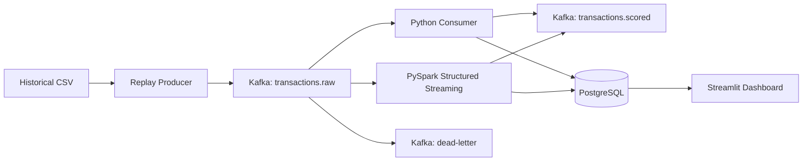

# Coding Agent Handoff: Complete the Real-Time Fraud Detection System

## 1. Project objective

Complete and polish an end-to-end **Real-Time Fraud Detection System** that simulates incoming credit-card transactions, sends them through Kafka, scores them using a trained XGBoost model, stores the results in PostgreSQL, and visualizes operational and fraud metrics in a professional Streamlit dashboard.

The project already has a working MVP. The remaining work is to:

1. Preserve and stabilize the working Python pipeline.
2. Containerize the application components.
3. Provide one-command startup.
4. Add PySpark Structured Streaming as an optional advanced processing engine.
5. Improve the dashboard design and responsiveness.
6. Improve transaction replay realism.
7. Add monitoring, testing, recovery, documentation, and developer tooling.
8. Make the repository portfolio-ready.

Do not rewrite working components unnecessarily. Refactor only when needed for correctness, maintainability, or shared functionality.

---

## 2. Current working status

The following components already work:

- Kaggle model-training notebook
- XGBoost fraud-detection model
- Exported preprocessing and model pipeline
- Kafka in KRaft mode
- Automatic Kafka topic creation
- Kafka UI
- PostgreSQL
- Python CSV replay producer
- Python Kafka consumer
- Model inference
- Prediction persistence in PostgreSQL
- Streamlit dashboard
- Docker Compose infrastructure

Current working transaction flow:

```text
creditcard.csv
      ↓
Python replay producer
      ↓
Kafka: transactions.raw
      ↓
Python scoring consumer
      ↓
XGBoost pipeline
      ↓
Kafka: transactions.scored
      ↓
PostgreSQL
      ↓
Streamlit dashboard
```

The user currently starts the producer, consumer, and dashboard manually in separate terminals. This must be automated with Docker Compose.

---

## 3. Important environment details

### Development environment

- Host operating system: Windows
- Python: 3.12
- Docker Desktop is installed and working
- Local PostgreSQL already occupies host port `5432`
- Docker PostgreSQL must use host port `5433`
- Container PostgreSQL still listens internally on `5432`

Expected host-side database settings:

```dotenv
POSTGRES_HOST=localhost
POSTGRES_PORT=5433
POSTGRES_DB=fraud_db
POSTGRES_USER=fraud_user
POSTGRES_PASSWORD=fraud_dev_password
```

Inside Docker Compose application containers, use:

```dotenv
POSTGRES_HOST=postgres
POSTGRES_PORT=5432
```

Do not configure containers to connect to `localhost:5433`. Within the Docker network, containers must use the service name `postgres` and internal port `5432`.

### Model compatibility versions

The model was trained with:

```text
Python: 3.12.13
scikit-learn: 1.6.1
XGBoost: 3.2.0
```

The local Python patch version may differ, but the following versions must be pinned:

```text
scikit-learn==1.6.1
xgboost==3.2.0
```

Do not upgrade these packages without retraining or re-exporting the model.

The existing `joblib` artifact requires compatible training and serving environments. For long-term portability, export the underlying XGBoost booster using `save_model()` in JSON or UBJSON format while retaining the currently verified pipeline for this project version.

---

## 4. Existing project structure

The project currently resembles:

```text
.
├── .env
├── .env.example
├── .gitignore
├── docker-compose.yml
├── README.md
├── requirements-local.txt
├── requirements-producer.txt
├── requirements-consumer.txt
├── requirements-dashboard.txt
│
├── data/
│   ├── README.md
│   └── creditcard.csv
│
├── models/
│   ├── feature_schema.json
│   ├── fraud_pipeline.joblib
│   ├── metrics.json
│   ├── model_metadata.json
│   ├── test_samples.csv
│   └── threshold.json
│
├── notebooks/
│   ├── fraud_detection_modeling_kaggle.ipynb
│   └── fraud_detection_modeling_kaggle_results.ipynb
│
├── scripts/
│   ├── check_infrastructure.py
│   └── verify_model.py
│
├── sql/
│   └── init.sql
│
├── src/
│   ├── __init__.py
│   ├── producer/
│   │   ├── __init__.py
│   │   ├── producer.py
│   │   └── schema.py
│   ├── consumer/
│   │   ├── __init__.py
│   │   └── consumer.py
│   ├── scoring/
│   │   ├── __init__.py
│   │   ├── consumer.py
│   │   ├── inference.py
│   │   ├── model_loader.py
│   │   └── schema.py
│   └── dashboard/
│       ├── __init__.py
│       ├── dashboard.py
│       └── database.py
│
└── tests/
    ├── test_producer_schema.py
    ├── test_scoring.py
    └── test_dashboard_database.py
```

There may be duplicate consumer implementations under `src/consumer` and `src/scoring`. Inspect both before modifying anything.

Choose one canonical lightweight consumer and document the other as deprecated or remove it after confirming that no functionality is lost.

---

## 5. Existing model results

Use the following official model results in the final documentation.

### Validation results

```json
{
  "pr_auc": 0.8364164836283232,
  "roc_auc": 0.9791664950292756,
  "precision": 0.9655172413793104,
  "recall": 0.7567567567567568,
  "f1": 0.8484848484848485,
  "true_negatives": 42645,
  "false_positives": 2,
  "false_negatives": 18,
  "true_positives": 56,
  "false_positives_per_1000": 0.04681538353502961
}
```

### Test results

```json
{
  "pr_auc": 0.8417739725281347,
  "roc_auc": 0.9699196945961155,
  "precision": 0.9365079365079365,
  "recall": 0.7972972972972973,
  "f1": 0.8613138686131386,
  "true_negatives": 42644,
  "false_positives": 4,
  "false_negatives": 15,
  "true_positives": 59,
  "false_positives_per_1000": 0.09362857544122466
}
```

### Decision threshold

```text
0.9152204990386963
```

Threshold-selection rule:

```text
Maximum validation F1
```

The dashboard should label the model output as a **risk score**, not an exact calibrated fraud probability.

---

## 6. Target architecture

The final project must support two processing modes.

### Mode A: Lightweight Python mode

```text
CSV replay producer
      ↓
Kafka: transactions.raw
      ↓
Python scoring consumer
      ├── JSON validation
      ├── model inference
      ├── threshold application
      ├── scored Kafka output
      └── PostgreSQL persistence
      ↓
Streamlit dashboard
```

This should be the default mode because it is lightweight and appropriate for local use.

### Mode B: PySpark Structured Streaming mode

```text
CSV replay producer
      ↓
Kafka: transactions.raw
      ↓
PySpark Structured Streaming
      ├── explicit JSON schema
      ├── valid/invalid event separation
      ├── micro-batch model inference
      ├── dead-letter publication
      ├── scored Kafka publication
      ├── PostgreSQL upserts
      └── checkpoint recovery
      ↓
Streamlit dashboard
```

Only one processing engine may run at a time. The Python consumer and Spark consumer must not simultaneously process the same simulated transaction stream into the same sink.

---

## 7. Implementation phases

### Phase A: Audit and stabilize the repository

Before adding features:

1. Inspect all existing files.
2. Run all current tests.
3. Run model verification.
4. Verify Docker Compose services.
5. Identify duplicate consumer implementations.
6. Identify configuration duplication.
7. Create a Git checkpoint before refactoring.
8. Document current working commands.
9. Do not delete working functionality without tests proving equivalence.

Create a reusable settings module:

```text
src/common/
├── __init__.py
├── config.py
├── logging_config.py
└── constants.py
```

Centralize:

- Topic names
- Model paths
- Database settings
- Kafka bootstrap servers
- Model version
- Threshold path
- Schema version
- Logging configuration
- Replay defaults
- Spark checkpoint locations

Avoid hard-coded connection values throughout the source.

### Phase B: Clean project organization

Move toward this final structure:

```text
.
├── README.md
├── LICENSE
├── CONTRIBUTING.md
├── CHANGELOG.md
├── Makefile
├── pyproject.toml
├── docker-compose.yml
├── docker-compose.spark.yml
├── .env.example
├── .gitignore
│
├── config/
│   ├── development.yaml
│   └── logging.yaml
│
├── data/
│   └── README.md
│
├── docker/
│   ├── producer.Dockerfile
│   ├── consumer.Dockerfile
│   ├── dashboard.Dockerfile
│   └── spark.Dockerfile
│
├── models/
│   ├── README.md
│   ├── feature_schema.json
│   ├── fraud_pipeline.joblib
│   ├── xgboost_model.ubj
│   ├── metrics.json
│   ├── model_metadata.json
│   ├── test_samples.csv
│   └── threshold.json
│
├── notebooks/
│
├── scripts/
│   ├── create_topics.sh
│   ├── smoke_test.py
│   ├── verify_model.py
│   ├── check_infrastructure.py
│   ├── reset_demo.py
│   ├── export_xgboost_model.py
│   └── wait_for_services.py
│
├── sql/
│   ├── 001_init.sql
│   └── 002_dashboard_views.sql
│
├── src/
│   ├── common/
│   ├── producer/
│   ├── consumer/
│   ├── streaming/
│   ├── persistence/
│   └── dashboard/
│
├── tests/
│   ├── unit/
│   ├── integration/
│   ├── contract/
│   └── fixtures/
│
└── checkpoints/
    └── .gitkeep
```

Do not commit:

```text
.env
.venv/
data/creditcard.csv
models/*.joblib
checkpoints/*
__pycache__/
.pytest_cache/
```

Keep documentation files through explicit `.gitignore` exceptions.

---

## 8. One-command Docker system

### Required services

Extend Docker Compose to include:

```text
kafka
topic-init
kafka-ui
postgres
consumer-python
dashboard
producer
spark-consumer
```

### Default services

Running:

```bash
docker compose up -d
```

should automatically start:

- Kafka
- PostgreSQL
- Topic initialization
- Kafka UI
- Python consumer
- Streamlit dashboard

### Simulation profile

The producer represents an external transaction source, so make it optional through a profile.

Running:

```bash
docker compose --profile simulation up -d
```

should start everything, including the producer.

### Spark profile

Running:

```bash
docker compose --profile spark up -d
```

should:

- Start Kafka
- Start PostgreSQL
- Start Kafka UI
- Start the dashboard
- Start the Spark processor
- Not start the Python consumer

Because profile dependencies can become complicated, it may be cleaner to use:

```text
docker-compose.yml
docker-compose.spark.yml
```

Then run:

```bash
docker compose -f docker-compose.yml -f docker-compose.spark.yml up -d
```

The agent should choose the clearest reliable approach and document it.

### Startup dependencies

Use reliable health checks:

- Kafka health check
- PostgreSQL `pg_isready`
- Dashboard HTTP health check
- Consumer process health check or heartbeat
- Spark UI/process health check

Use health conditions when a dependent service must wait for readiness.

### Automatic topic creation

The following topics must be created automatically:

```text
transactions.raw
transactions.scored
transactions.dead-letter
```

Expected configuration:

```text
transactions.raw:         3 partitions
transactions.scored:      3 partitions
transactions.dead-letter: 1 partition
replication factor:       1 for local development
```

The initialization must:

1. Wait until Kafka genuinely responds.
2. Use `--if-not-exists`.
3. Be safe to run repeatedly.
4. Exit with code zero on success.
5. Print the resulting topic list.
6. Run on every clean environment launch.

---

## 9. Containerize the current Python applications

### Producer image

The producer container must:

- Use a pinned Python base image.
- Install only producer dependencies.
- Mount or access `data/creditcard.csv`.
- Connect to Kafka using `kafka:29092`.
- Have configurable replay options through environment variables.
- Shut down gracefully.
- Default to a safe replay rate.
- Be part of the `simulation` profile.

Suggested environment contract:

```dotenv
KAFKA_BOOTSTRAP_SERVERS=kafka:29092
KAFKA_INPUT_TOPIC=transactions.raw
REPLAY_EVENTS_PER_SECOND=20
REPLAY_LIMIT=10000
REPLAY_LOOP=true
REPLAY_MODE=demo
REPLAY_RUN_ID=default
```

### Consumer image

The Python consumer container must:

- Load the verified model artifact.
- Use pinned model dependencies.
- Connect to `kafka:29092`.
- Connect to `postgres:5432`.
- Retry Kafka and PostgreSQL startup failures.
- Use manual Kafka commits.
- Commit only after successful scored output and database persistence.
- Handle SIGTERM gracefully.
- Log processed, failed, fraud-alert, and throughput counts.
- Never expose secrets in logs.

### Dashboard image

The dashboard container must:

- Connect to `postgres:5432`.
- Bind Streamlit to `0.0.0.0`.
- Publish host port `8501`.
- Use a health check.
- Avoid embedding credentials in the image.

---

## 10. Improve the transaction producer

Add realistic replay capabilities without fabricating records.

### Required command-line options

```text
--events-per-second
--limit
--loop
--start-row
--end-row
--shuffle
--seed
--run-id
--mode
--fraud-interval
--fraud-ratio
--variable-rate
--min-events-per-second
--max-events-per-second
--dry-run
```

### Replay modes

#### Chronological mode

Preserve original CSV order.

```bash
python -m src.producer.producer --mode chronological
```

#### Shuffle mode

Randomize row order using a fixed seed for reproducibility.

```bash
python -m src.producer.producer --mode shuffle --seed 42
```

#### Demo mode

Use actual rows from the dataset but interleave occasional real fraud rows so a short presentation displays alerts.

Rules:

- Do not modify feature values.
- Do not alter labels.
- Do not synthetically convert legitimate rows into fraud.
- Clearly include `"replay_mode": "demo"` in each event.
- Never use demo traffic to report official model metrics.
- Document that only replay order and sampling frequency are changed.

### Deterministic IDs

Current UUIDs make repeated runs difficult to deduplicate. Introduce:

```text
run_id
source_row_index
transaction_id
```

Generate deterministic IDs from:

```text
dataset name + run ID + source row index
```

For example, use UUID5.

Expected behavior:

- Same run ID plus same source row produces the same transaction ID.
- New run ID produces a separate simulated replay.
- Repeating a crashed run does not duplicate PostgreSQL records.

### Timing realism

Support fixed and variable arrival rates.

Variable-rate mode should use randomized delays around the target throughput. Do not claim it reproduces real banking traffic. Document it as a traffic simulation.

### Producer metrics

Log:

- Total published
- Current events per second
- Average events per second
- Fraud rows published
- Delivery failures
- Producer queue size
- Replay mode
- Run ID
- Current row index

---

## 11. Canonical event schemas

### Raw event

Use a versioned schema resembling:

```json
{
  "transaction_id": "uuid",
  "run_id": "demo-20260911-001",
  "source_row_index": 157,
  "sequence_number": 42,
  "event_time": "2026-09-11T15:00:00Z",
  "producer_time": "2026-09-11T15:00:00.041Z",
  "source": "kaggle_creditcard_replay",
  "replay_mode": "demo",
  "schema_version": "1.1",
  "actual_label": 1,
  "features": {
    "Time": 406.0,
    "V1": -2.31,
    "V2": 1.95,
    "V3": -1.61,
    "Amount": 0.0
  }
}
```

The actual object must contain all `V1` to `V28` fields.

### Scored event

Add:

```json
{
  "risk_score": 0.9712,
  "predicted_label": 1,
  "decision_threshold": 0.9152204990386963,
  "model_version": "1.0.0",
  "processed_time": "2026-09-11T15:00:00.170Z",
  "processing_latency_ms": 129.0,
  "processor": "python",
  "stream_batch_id": null,
  "prediction_correct": true
}
```

For Spark, use:

```json
{
  "processor": "spark",
  "stream_batch_id": 1234
}
```

### Dead-letter event

Include:

```json
{
  "failed_at": "timestamp",
  "error_type": "SchemaValidationError",
  "error_message": "missing feature V12",
  "source_topic": "transactions.raw",
  "source_partition": 1,
  "source_offset": 1823,
  "processor": "spark",
  "raw_payload": "original message"
}
```

Do not silently discard invalid events.

---

## 12. PySpark Structured Streaming implementation

### General requirement

Implement Spark as an optional replacement for the Python consumer.

Create:

```text
src/streaming/
├── __init__.py
├── spark_consumer.py
├── schemas.py
├── transformations.py
├── inference.py
├── postgres_sink.py
├── kafka_sink.py
└── metrics_listener.py
```

### Spark version

Select a stable Spark version that:

- Has a compatible Python version.
- Has a matching Kafka connector artifact.
- Runs reliably in Docker Desktop.
- Can install the pinned Python ML dependencies.
- Is explicitly pinned.

Do not use `latest`.

The Kafka connector artifact must match the chosen Spark and Scala binary versions.

### Kafka source

Use:

```python
spark.readStream.format("kafka")
```

Configuration must include:

```text
kafka.bootstrap.servers=kafka:29092
subscribe=transactions.raw
startingOffsets=earliest or latest via configuration
failOnDataLoss=false only if clearly justified
maxOffsetsPerTrigger configurable
```

Default production-like behavior should resume from checkpoints.

### Explicit schema

Do not infer schemas from streaming JSON.

Define a complete `StructType` for:

- Transaction metadata
- Features
- Labels
- Replay metadata

Parse Kafka values with `from_json`.

Separate valid and invalid events using Spark expressions.

Validate:

- Required fields
- Schema version
- Transaction ID
- Positive sequence number
- All 30 features
- Finite numerical values
- Non-negative amount
- Label in `{0, 1}`
- Valid timestamps

### Inference approach

Avoid a row-by-row standard Python UDF if possible.

Preferred order:

1. Use `foreachBatch` with vectorized Pandas/DataFrame inference.
2. Load the model once per worker or once per batch process.
3. Preserve exact feature names and order.
4. Score records as batches.
5. Return a Spark DataFrame with prediction columns.

Do not call `joblib.load()` for every row.

Because the current model is a scikit-learn pipeline containing preprocessing and XGBoost, preserve the entire pipeline for inference. Do not duplicate transformations manually unless equivalence is tested.

### `foreachBatch`

Use `foreachBatch` for custom PostgreSQL upserts and, if appropriate, model scoring.

For every micro-batch:

1. Return immediately if the batch is empty.
2. Persist the batch temporarily if multiple actions are performed.
3. Validate records.
4. Route invalid records to the dead-letter topic.
5. Score valid records in batches.
6. Produce scored Kafka events.
7. Upsert transactions.
8. Upsert predictions.
9. Record batch status.
10. Unpersist the batch.

### Checkpointing

Set a unique persistent checkpoint location:

```text
/checkpoints/fraud-scoring-spark
```

The checkpoint must be mounted as a volume.

Do not delete checkpoints during normal restarts.

### Idempotency

Structured Streaming and an external relational database require explicit sink idempotency.

Use:

```sql
UNIQUE (transaction_id, model_version, processor)
```

or another precise business key.

Use PostgreSQL:

```sql
INSERT ... ON CONFLICT ... DO UPDATE
```

or:

```sql
ON CONFLICT DO NOTHING
```

depending on desired semantics.

Use `batch_id` to track completed micro-batches in `stream_batches`.

Before processing a batch:

- Check whether the batch ID and processor/checkpoint identity are already completed.
- If completed, safely skip or verify idempotent upserts.
- If started but not completed, replay safely.
- Mark completed only after sinks succeed.

Do not claim exactly-once delivery unless the complete Kafka-to-PostgreSQL behavior has been demonstrated and tested. Describe the implementation as checkpointed at-least-once processing with idempotent sink semantics unless stronger guarantees are proven.

### Spark error handling

Invalid input should not crash the full stream.

Unexpected infrastructure or model errors should:

- Log the batch ID.
- Mark the stream batch as failed.
- Preserve the checkpoint.
- Cause the job to retry or fail loudly based on configuration.
- Never commit a batch as completed after partial failure.

### Spark metrics

Collect:

- Input rows per second
- Processed rows per second
- Batch duration
- Number of input rows
- Kafka offset ranges
- Event-time or processing-time lag
- Fraud alerts per batch
- Invalid events per batch
- PostgreSQL write time
- Model inference time
- Last completed batch ID

Store selected metrics in PostgreSQL for visualization.

---

## 13. PostgreSQL improvements

### Schema audit

The current database includes approximately:

```text
transactions
predictions
stream_batches
model_registry
data_quality_events
```

Review and migrate safely.

### Recommended transaction fields

```text
transaction_id UUID PRIMARY KEY
run_id VARCHAR
source_row_index INTEGER
sequence_number INTEGER
event_time TIMESTAMPTZ
producer_time TIMESTAMPTZ
source VARCHAR
replay_mode VARCHAR
schema_version VARCHAR
amount DOUBLE PRECISION
elapsed_time DOUBLE PRECISION
features JSONB
actual_label SMALLINT
received_at TIMESTAMPTZ
```

### Recommended prediction fields

```text
prediction_id BIGSERIAL PRIMARY KEY
transaction_id UUID
model_version VARCHAR
processor VARCHAR
fraud_score DOUBLE PRECISION
decision_threshold DOUBLE PRECISION
predicted_label SMALLINT
processed_at TIMESTAMPTZ
processing_latency_ms DOUBLE PRECISION
stream_batch_id BIGINT
prediction_correct BOOLEAN
```

### Constraints

Add:

```text
CHECK fraud_score BETWEEN 0 AND 1
CHECK decision_threshold BETWEEN 0 AND 1
CHECK labels IN (0, 1)
CHECK amount >= 0
UNIQUE(transaction_id, model_version, processor)
```

### Indexes

Add indexes for dashboard queries:

```text
predictions(processed_at DESC)
predictions(predicted_label, fraud_score DESC)
predictions(model_version)
predictions(processor)
transactions(event_time DESC)
transactions(run_id)
transactions(actual_label)
stream_batches(started_at DESC)
data_quality_events(created_at DESC)
```

### Dashboard views

Create SQL views or materialized views for:

```text
dashboard_summary
dashboard_performance
dashboard_minute_metrics
dashboard_recent_alerts
dashboard_processor_health
dashboard_data_quality
```

Prefer regular views at this project scale unless materialized views are shown to be necessary.

---

## 14. Dashboard redesign

The existing dashboard works but must be redesigned to look like a polished fraud-monitoring operations console.

### Visual direction

Use a professional, clean monitoring aesthetic:

- Dark navy or light neutral background
- Clear red or orange alert accents
- Green healthy-state accents
- Blue operational accents
- Consistent spacing
- Rounded cards
- Restrained shadows
- Clear typography hierarchy
- No cluttered rainbow charts
- Responsive wide-screen layout
- Accessible color contrast
- Icons used sparingly

Do not simulate values. Display only actual PostgreSQL data.

### Page structure

#### Header

Include:

- Project title
- Live or paused indicator
- Processor mode badge: Python or Spark
- Kafka status
- PostgreSQL status
- Last processed timestamp
- Manual refresh button

#### Sidebar

Include:

- Auto-refresh toggle
- Refresh interval
- Processor filter
- Run ID filter
- Model version filter
- Time range
- Risk-score range
- Predicted-label filter
- Actual-label filter
- Amount range
- Clear filters button

#### KPI row

Show:

- Total transactions scored
- Transactions per second
- Fraud alerts
- Alert rate
- Total amount flagged
- Average latency
- P95 latency
- Consumer or Spark lag
- Invalid-event count

#### Live stream section

Show:

- Transactions per minute
- Fraud alerts per minute
- Throughput over time
- Latency over time
- Current processing status

#### Fraud intelligence section

Show:

- High-risk transaction table
- Fraud score
- Amount
- Actual label
- Predicted label
- Model version
- Processor
- Latency
- Timestamp
- Expandable full feature details

#### Model performance section

Show:

- Precision
- Recall
- F1
- PR-oriented information from the official model report
- Confusion matrix
- False positives
- False negatives
- Correct and incorrect alerts

Clearly distinguish:

```text
Offline test metrics
```

from:

```text
Current replay-session metrics
```

Do not mix them into one metric.

#### Operational health section

Show:

- Last completed batch
- Latest Kafka offsets
- Processor heartbeat
- Last PostgreSQL write
- Invalid messages
- Dead-letter totals
- Model version loaded
- Current threshold
- Active replay mode
- Active run ID

#### Data quality section

Show:

- Missing-feature errors
- Invalid schema versions
- Malformed JSON
- Negative amounts
- Duplicate records
- Dead-letter trend

### Auto-refresh implementation

Remove blocking `time.sleep()` calls from the main Streamlit script.

Use `st.fragment(run_every=...)` for independently refreshed dashboard sections when the installed Streamlit version supports it.

### Database efficiency

- Do not reload entire tables.
- Query bounded time windows.
- Use indexed filters.
- Cache static model metadata.
- Use short-lived caching for aggregates.
- Handle empty tables.
- Handle database reconnections.
- Display a friendly disconnected state.
- Avoid one database connection per small widget if data can be fetched in a single query.

### Dashboard accuracy

The first 100 chronological rows may contain no fraud. The dashboard must not imply failure when there are no alerts.

Display:

```text
No fraud alerts in the selected window
```

rather than showing an error.

Label historical replay explicitly:

> Historical anonymized transactions are replayed through Kafka to simulate a live payment stream.

Label risk score explicitly:

> The risk score is a model output and is not guaranteed to be a calibrated real-world probability.

---

## 15. Monitoring and health

Implement application-level health reporting.

### Processor heartbeat

Create a table:

```text
service_heartbeats
```

Suggested fields:

```text
service_name
instance_id
processor_type
status
last_seen_at
details JSONB
```

Update periodically from:

- Python consumer
- Spark consumer
- Producer
- Dashboard if useful

### Service statuses

The dashboard should derive:

```text
Healthy: heartbeat within expected interval
Delayed: heartbeat stale
Offline: heartbeat absent beyond threshold
```

### Structured logging

Use consistent JSON or structured text logs with:

```text
timestamp
level
service
run_id
transaction_id
batch_id
topic
partition
offset
event
message
```

Do not log complete sensitive payloads except in explicitly configured debug mode.

---

## 16. Testing requirements

### Unit tests

Add tests for:

- Producer row validation
- Event schema construction
- Deterministic transaction ID generation
- Replay-mode selection
- Model artifact loading
- Feature order
- Threshold loading
- Valid-event scoring
- Invalid event handling
- Scored-event schema
- Database configuration
- Dashboard query helpers
- Spark schema construction
- Spark transformations

### Contract tests

Test the full model contract:

- 30 expected feature fields
- Exact feature names
- Exact feature order
- Model version availability
- Threshold range
- Risk score range
- Prediction equals `risk_score >= threshold`
- Kaggle and local sample probabilities match

### Integration tests

Use small fixtures.

Test:

```text
Producer → Kafka raw topic
Kafka raw topic → Python consumer
Python consumer → scored topic
Python consumer → PostgreSQL
Spark consumer → scored topic
Spark consumer → PostgreSQL
PostgreSQL → dashboard queries
Invalid Kafka message → dead-letter topic
```

### Recovery tests

Test:

1. Stop the consumer during processing.
2. Restart it and verify continuation.
3. Restart Kafka.
4. Restart PostgreSQL.
5. Reprocess the same run ID.
6. Verify no duplicate predictions.
7. Submit malformed JSON.
8. Submit missing model features.
9. Submit an invalid schema version.
10. Force one database write failure.
11. Verify failed batches are not marked complete.
12. Restart Spark from its existing checkpoint.

### Performance tests

Measure:

- Producer achieved events per second
- Python consumer throughput
- Spark consumer throughput
- Average processing latency
- P50 latency
- P95 latency
- P99 latency
- Database write duration
- Model inference duration
- Maximum sustainable rate for local Docker Desktop

Do not claim Spark is faster unless benchmarks prove it.

### Test data policy

Do not require the full CSV for unit tests.

Put small non-sensitive fixtures in:

```text
tests/fixtures/
```

---

## 17. Developer experience

### Makefile or task runner

Provide commands such as:

```text
make setup
make up
make demo
make down
make reset
make logs
make test
make test-integration
make verify-model
make spark-up
make spark-down
make benchmark
```

On Windows, also provide equivalent PowerShell scripts:

```text
scripts/setup.ps1
scripts/start.ps1
scripts/start-demo.ps1
scripts/stop.ps1
scripts/reset.ps1
scripts/test.ps1
```

### Example final commands

Default lightweight application:

```bash
docker compose up -d
```

Full lightweight demonstration:

```bash
docker compose --profile simulation up -d
```

Spark demonstration:

```bash
docker compose -f docker-compose.yml -f docker-compose.spark.yml up -d
```

Stop:

```bash
docker compose down
```

Full development reset:

```bash
docker compose down -v
```

Document that `-v` deletes local Kafka and PostgreSQL data.

---

## 18. CI pipeline

Create a GitHub Actions workflow.

### Pull-request checks

Run:

- Ruff or Flake8
- Black check
- Import sorting check
- Type checking where practical
- Unit tests
- Contract tests
- Model-file presence checks without requiring the private binary
- Docker Compose configuration validation
- Docker image builds
- SQL syntax checks if practical

### Integration workflow

Optionally run on the main branch or manually:

- Start Kafka and PostgreSQL
- Create topics
- Publish fixture events
- Run consumer
- Check PostgreSQL counts
- Verify dead-letter handling
- Shut down services

Do not require `creditcard.csv` in CI.

---

## 19. Security and repository hygiene

- Never commit `.env`.
- Commit `.env.example` with placeholders.
- Do not commit real database credentials.
- Do not commit Kaggle API credentials.
- Only load trusted `joblib` files.
- Bind local PostgreSQL to loopback if host access is needed:

```yaml
ports:
  - "127.0.0.1:${POSTGRES_PORT:-5433}:5432"
```

- Keep Kafka and PostgreSQL on an internal Docker network.
- Do not expose Spark administrative interfaces beyond local development.
- Validate all Kafka input.
- Limit raw dead-letter payload size.
- Avoid SQL string interpolation.
- Use parameterized SQL queries.
- Provide dependency vulnerability scanning if possible.

---

## 20. Final README requirements

Create a complete main `README.md`.

### Required sections

1. Project title
2. Short description
3. Demo screenshot or GIF placeholder
4. Architecture diagram
5. Features
6. Technology stack
7. Dataset information
8. Model results
9. Repository structure
10. Prerequisites
11. Quick start
12. Lightweight mode
13. Spark mode
14. Dashboard usage
15. Replay modes
16. Configuration
17. Kafka topics
18. PostgreSQL schema
19. Testing
20. Recovery behavior
21. Performance benchmarking
22. Troubleshooting
23. Known limitations
24. Future improvements
25. Dataset attribution
26. License

### Architecture diagram

Provide a Mermaid diagram:



Clearly indicate that Python and Spark are alternative processing modes.

### Model-results explanation

Include the exact metrics supplied above. Explain:

- Severe class imbalance
- Why accuracy is misleading
- Why PR-AUC matters
- Threshold selected on validation data
- Test data remained untouched until final evaluation
- Dashboard risk score is not necessarily calibrated

### Known limitations

Include:

- Historical dataset rather than a real bank feed
- Anonymized PCA features
- Limited business context
- Single-broker local Kafka deployment
- Single-node local Spark demonstration
- Ground-truth label available only because this is historical replay
- Model drift is simulated or monitored, not fully solved
- No true production authentication or authorization
- Fraud-demo mode changes sampling or order and must not be used for official metrics

---

## 21. Final acceptance criteria

The project is complete only when all the following pass.

### Lightweight mode

```text
[ ] docker compose up -d succeeds
[ ] Kafka becomes healthy
[ ] PostgreSQL becomes healthy
[ ] Topics are created automatically
[ ] Python consumer starts automatically
[ ] Dashboard starts automatically
[ ] Dashboard is reachable at localhost:8501
[ ] Kafka UI is reachable at localhost:8080
```

### Simulation mode

```text
[ ] Producer starts through the simulation profile
[ ] Raw events appear in transactions.raw
[ ] Scored events appear in transactions.scored
[ ] Predictions appear in PostgreSQL
[ ] Dashboard updates without manual refresh
[ ] Fraud-demo mode produces real fraud examples from the dataset
[ ] No source feature values or labels are fabricated
```

### Spark mode

```text
[ ] Spark reads transactions.raw
[ ] Explicit schema parsing works
[ ] Valid events are scored
[ ] Invalid events go to dead-letter
[ ] Predictions are written idempotently
[ ] Checkpoint survives restart
[ ] Restart does not duplicate predictions
[ ] Spark metrics are recorded
[ ] Python consumer is disabled in Spark mode
```

### Dashboard

```text
[ ] Professional responsive layout
[ ] Live health indicators
[ ] KPI cards
[ ] Throughput chart
[ ] Latency chart
[ ] Fraud-alert chart
[ ] Risk-score distribution
[ ] Confusion matrix
[ ] Precision, recall, and F1
[ ] High-risk transaction table
[ ] Data-quality panel
[ ] Processor filter
[ ] Run ID filter
[ ] Auto-refresh without blocking sleep loop
[ ] Friendly empty and disconnected states
```

### Quality

```text
[ ] All unit tests pass
[ ] All contract tests pass
[ ] Integration smoke test passes
[ ] Duplicate replay is idempotent
[ ] Model verification passes
[ ] Dependencies are pinned
[ ] README is complete
[ ] No credentials are committed
[ ] creditcard.csv is ignored
[ ] Docker images use fixed versions
```

---

## 22. Required implementation order

The coding agent must follow this order:

1. Audit the current repository and run existing tests.
2. Create a checkpoint commit.
3. Centralize configuration and dependency versions.
4. Resolve duplicate consumer implementations.
5. Containerize the working producer, Python consumer, and dashboard.
6. Achieve one-command lightweight startup.
7. Add the simulation profile.
8. Improve deterministic replay and demo mode.
9. Add PostgreSQL migrations and views.
10. Redesign the dashboard.
11. Add health and operational metrics.
12. Add PySpark Structured Streaming mode.
13. Add checkpointing and idempotent Spark writes.
14. Add unit, contract, integration, recovery, and performance tests.
15. Add CI.
16. Write final documentation.
17. Run a clean-machine-style setup test.
18. Provide a completion report listing changed files, commands, test results, and known limitations.

Do not start with PySpark before preserving the already working Python application.

---

## 23. Instructions to the coding agent

Use the following operating rules:

- Do not ask for confirmation after every phase.
- Inspect existing code before changing it.
- Preserve working behavior.
- Use small commits with clear commit messages.
- Never fabricate test outputs.
- Never fabricate benchmark numbers.
- Never claim exactly-once semantics without proving them.
- Prefer official Kafka, Spark, Docker, PostgreSQL, Streamlit, scikit-learn, and XGBoost documentation.
- Pin all image and package versions.
- Maintain Windows compatibility.
- Keep commands available for PowerShell.
- Do not require locally installed Kafka, Spark, or PostgreSQL.
- Assume Docker Desktop is available.
- Account for local PostgreSQL occupying host port `5432`.
- Use host port `5433` for Docker PostgreSQL.
- Inside Docker, connect to `postgres:5432`.
- Keep the Python consumer as the default.
- Implement Spark as an optional advanced mode.
- Do not run Python and Spark processors simultaneously.
- End with a full clean-launch test.

---

## 24. Final expected user experience

### Simple local mode

```powershell
Copy-Item .env.example .env
docker compose up -d
```

Open:

```text
Dashboard: http://localhost:8501
Kafka UI:  http://localhost:8080
```

### Fully automatic demonstration

```powershell
docker compose --profile simulation up -d
```

The user should not manually start the producer, consumer, or dashboard.

### Spark demonstration

```powershell
docker compose -f docker-compose.yml -f docker-compose.spark.yml up -d
```

The Spark processor should replace the Python consumer and continue feeding the same PostgreSQL-backed dashboard.

---

## Final delivery report required from the coding agent

At completion, provide:

1. A summary of the completed architecture.
2. A list of all created, removed, and modified files.
3. Exact startup commands for all modes.
4. Test results with commands used.
5. Model verification results.
6. Docker service health results.
7. Integration-test results.
8. Recovery-test results.
9. Measured performance results, if benchmarks were run.
10. Known limitations and remaining optional enhancements.

This plan prioritizes finishing and automating the already working system before adding the more complex Spark mode. That protects the current MVP while producing a polished project that demonstrates machine learning, event streaming, databases, containerization, distributed processing, monitoring, and dashboard design.
