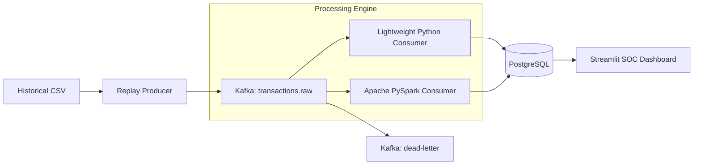
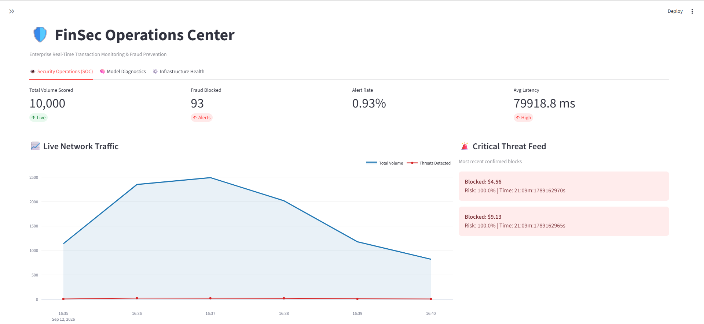

<div align="center">

# 🛡️ FinSec Real-Time Fraud Detection System

**Enterprise Real-Time Transaction Monitoring & Streaming Analytics Platform**

[](https://github.com/abderrahmane0402/Credit-Card-Fraud-Detection/actions/workflows/ci.yml)
[](https://kafka.apache.org)
[](https://spark.apache.org)
[](https://python.org)
[](https://postgresql.org)
[](https://xgboost.readthedocs.io)
[](https://streamlit.io)
[](https://docker.com)
[](https://opensource.org/licenses/MIT)

An end-to-end, containerized Real-Time Fraud Detection System designed to ingest, score, and visualize credit card transactions at scale using Apache Kafka, PostgreSQL, XGBoost, and PySpark streaming.

🌐 **Live Demo:** [https://abdsabkari.duckdns.org/fraudapp/](https://abdsabkari.duckdns.org/fraudapp/)

[Features](#-key-features) • [Architecture](#️-architecture) • [Dataset & Model](#-the-model--dataset) • [Quickstart](#-running-the-system) • [SOC Dashboard](#-the-soc-dashboard) • [Tech Stack](#️-technology-stack) • [License](#-license)

</div>

---

## ⚡ Key Features

- **⚡ Sub-Second Inference Latency**: Real-time scoring of streaming credit card transactions using an optimized XGBoost classification pipeline.
- **🌊 Distributed Message Streaming**: Fault-tolerant message ingestion and dead-letter queue (DLQ) isolation powered by **Apache Kafka**.
- **🔥 Dual-Backend Processing Engine**: Seamlessly toggle between a lightweight Python streaming consumer and a distributed **Apache PySpark** Structured Streaming engine.
- **🛡️ Enterprise SOC Operations Center**: Modern operations dashboard featuring live KPI counters, interactive Plotly traffic charts, and a real-time **Critical Threat Feed**.
- **🧠 Model Diagnostics & Telemetry**: Live confusion matrices, risk score distributions, precision/recall monitoring, and F1-score validation tracking.
- **⚙️ Self-Maintaining Storage Pipeline**: Automated rolling-window data retention and idempotent PostgreSQL batch inserts preventing database bloat.
- **🐳 100% Production Containerized**: Multi-container Docker Compose setup with orchestrated healthchecks, automated topic initialization, and automated recovery.
- **☁️ Cloud Deployed**: Live on Oracle Cloud Infrastructure (OCI) behind a **Caddy** reverse proxy with automatic SSL/HTTPS encryption.

---

## 🎯 Project Purpose

Financial institutions require sub-second latencies when determining if a transaction is legitimate or fraudulent. This project simulates a real-world banking environment where credit card transactions are streamed into a message broker (Kafka), processed and scored in real-time by an advanced Machine Learning model (XGBoost), and materialized into a live Security Operations Center (SOC) dashboard.

---

## 🏗️ Architecture


*(Note: Only one Processing Engine runs at a time. The system allows you to easily hot-swap between a standard Python consumer and a distributed PySpark engine).*

---

## 🧠 The Model & Dataset

### The Dataset
This system uses the highly popular **[Credit Card Fraud Detection dataset from Kaggle](https://www.kaggle.com/datasets/mlg-ulb/creditcardfraud)**. 
- Due to confidentiality, the dataset features (`V1` through `V28`) have been anonymized using Principal Component Analysis (PCA). 
- The only non-transformed features are `Time` and `Amount`. 
- The dataset is highly imbalanced, with frauds accounting for just 0.172% of all transactions.

### Training & Notebooks
The machine learning model was developed and trained in a Kaggle notebook environment. 
- You can find the exact training code, feature engineering, and evaluation logic inside the `notebooks/` directory (`fraud_detection_modeling_kaggle.ipynb`).
- We utilize an **XGBoost Classifier**. Because accuracy is a misleading metric for highly imbalanced data, the model was optimized for **PR-AUC (Precision-Recall Area Under Curve)**, achieving a Test F1 Score of 0.86.

### How it Scores Fraud
1. The model receives a transaction containing the 28 PCA features and the `Amount`.
2. It outputs a continuous **Risk Score** (between 0.0 and 1.0).
3. The system compares this risk score against a strictly calibrated **Decision Threshold**. If the risk score exceeds the threshold, the transaction is immediately classified as `1` (Fraud) and flagged in the dashboard.

---

## 🚀 Running the System

### 1. Prerequisites: Dataset Setup
Because of Git size limits, `creditcard.csv` is excluded from the repository. Before starting the containers, download the dataset and place it in the `data/` folder:

1. Download **[Credit Card Fraud Detection](https://www.kaggle.com/datasets/mlg-ulb/creditcardfraud)** from Kaggle.
2. Unzip the file and place `creditcard.csv` into the `data/` directory:
   ```bash
   # Destination:
   data/creditcard.csv
   ```

---

### 2. Launching the Services
This repository comes with a built-in **Simulation Producer**. When started, it will deterministically replay the historical Kaggle dataset into the Kafka stream at 20 transactions per second to simulate live banking traffic.

You have two choices for the backend processing engine. **We highly recommend using the Spark Engine** to demonstrate Big Data streaming capabilities.

> **⚠️ Download Warning:** 
> Because this is a microservice architecture, Docker will download significant dependencies (Python, Pandas, XGBoost, etc.). 
> - The **Lightweight Python Engine** will download roughly **~800 MB** of Docker layers.
> - The **Spark Engine** utilizes a completely different base environment (requiring Java, Hadoop, and PySpark). Running the Spark engine will require an *additional* download of **~1 GB**. 

### Option A: The Spark Engine (Recommended)
This uses PySpark Structured Streaming with micro-batches (`foreachBatch`) to achieve robust, idempotent PostgreSQL inserts.

To completely wipe any old data and start the Spark ecosystem fresh, run:
```bash
docker compose down -v
docker compose -f docker-compose.yml -f docker-compose.spark.yml --profile simulation up -d --build
```

### Option B: The Lightweight Python Engine
This uses standard `confluent-kafka` and is incredibly lightweight, predicting transactions one-by-one.

To completely wipe any old data and start the lightweight ecosystem fresh, run:
```bash
docker compose down -v
docker compose --profile simulation up -d --build
```

---

## 📊 The SOC Dashboard



- **Live Production URL:** [https://abdsabkari.duckdns.org/fraudapp/](https://abdsabkari.duckdns.org/fraudapp/)
- **Local Dashboard:** http://localhost:8501
- **Kafka UI:** http://localhost:8080

The dashboard is split into three professional tiers:
1. **Security Operations (SOC):** A business-facing view with KPI metrics, live traffic area-charts, and a real-time flashing **Critical Threat Feed** for blocked fraud.
2. **Model Diagnostics:** A data-science view tracking live Precision, Recall, F1 scores, Confusion Matrices, and risk distribution.
3. **Infrastructure Health:** An IT view monitoring end-to-end processing latency and dropped dead-letter payloads.

---

## 🛠️ Technology Stack
- **Languages:** Python 3.12, SQL, PySpark, Scala
- **Messaging:** Apache Kafka (Confluent)
- **Database:** PostgreSQL (with real-time materialized views)
- **Modeling:** XGBoost, Scikit-learn, Joblib
- **Dashboard:** Streamlit, Plotly
- **Infrastructure:** Docker, Docker Compose, Caddy Reverse Proxy, Oracle Cloud (OCI)

---

## 📜 License
This project is licensed under the MIT License - see the [LICENSE](LICENSE) file for details.